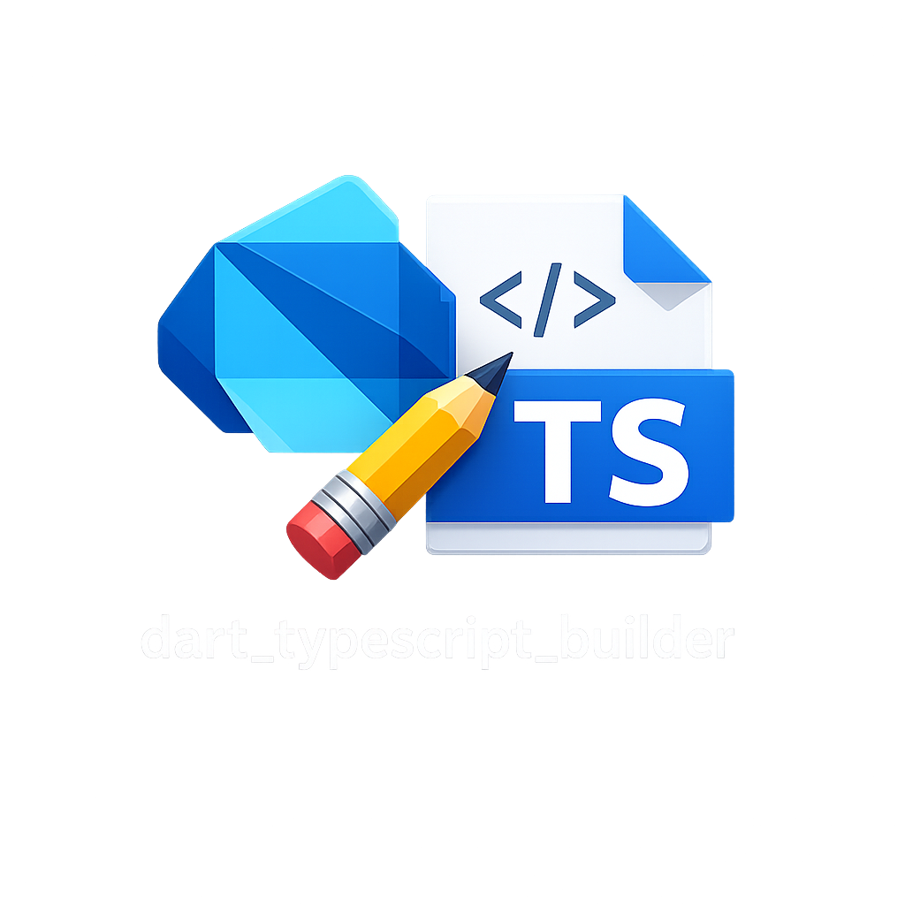

<p align="center">
  
</p>

# dart_typescript_builder

Write your logic once in Dart. Use it from Flutter **and** from a
TypeScript/Node backend.

This tool compiles a Dart package into an installable npm package: compiled
JS (or WASM), `dart:js_interop` bindings, and generated TypeScript
declarations. It is a bindings generator — think `wasm-pack` for Dart — not a
transpiler: the Dart stays Dart.

## Setup (once, in your Dart package)

Add the builder as a dev dependency:

```yaml
# pubspec.yaml
dev_dependencies:
  dart_typescript_builder:
    git: https://github.com/kekko7072/dart_typescript_builder
```

```sh
dart pub get
```

### Optional: pin the build in `dart_typescript_builder.yaml`

Instead of remembering the flags, drop a `dart_typescript_builder.yaml`
next to `pubspec.yaml` with the package's build command in one place:

```yaml
# Configuration for dart_typescript_builder
# (https://github.com/kekko7072/dart_typescript_builder, v0.4.x).
#
# A bare `dart run dart_typescript_builder` (no arguments) reads the
# `args:` line below and builds with it — so any automation (like the zsh
# `dart`/`flutter` wrapper below) rebuilds the typescript/ npm package
# after every successful `pub get` here.
#
# npm settings — the build creates a complete npm package in typescript/:
#   --out typescript            output directory of the npm package
#   --package-name ...          scoped npm name (version comes from
#                               pubspec.yaml, `+build` suffix stripped)
#   package.json, .gitignore + npm install (package-lock.json) are
#   produced by the tool.
#
# Firebase usage — this package's models describe Firestore documents:
#   --datetime firestore        every Dart DateTime crosses the boundary as a
#                               Firestore Timestamp; firebase-admin is
#                               declared as a peer dependency (>=11)
#   --firestore-types           the full firebase-admin value set survives
#                               inside dynamic data: Buffer/Uint8Array <->
#                               Uint8List, pass-through GeoPoint,
#                               DocumentReference, FieldValue, VectorValue

args: build . --out typescript --package-name @my-org/my-logic --datetime firestore --firestore-types
```

With that file in place, a bare invocation builds with the pinned args:

```sh
dart run dart_typescript_builder
```

A missing or old-format file (`inputs:`/`output:`, pre-0.3) fails loudly
with a migration message instead of silently printing usage — automations
break visibly, not quietly.

To rebuild automatically, add this to `~/.zshrc`: every `dart pub get` /
`flutter pub get` in a package that has a `dart_typescript_builder.yaml`
rebuilds its npm package:

```zsh
# Rebuild the generated npm package after every successful `pub get` in a
# package that opts in with a dart_typescript_builder.yaml.
_dtb_after_pub_get() {
  [[ -f dart_typescript_builder.yaml ]] && command dart run dart_typescript_builder
}

dart() {
  command dart "$@" || return $?
  [[ "$1 $2" == "pub get" ]] && _dtb_after_pub_get
  return 0
}

flutter() {
  command flutter "$@" || return $?
  [[ "$1 $2" == "pub get" ]] && _dtb_after_pub_get
  return 0
}
```

## Build

From the root of your Dart package:

```sh
dart run dart_typescript_builder build . --out typescript
```

That one command produces a **complete, ready-to-use npm package** in
`typescript/`:

- compiled logic (`<name>.dart.js` or `.wasm` + loader) and Node entry
- `index.d.ts` TypeScript declarations + generated `README.md`
- `package.json`, and `npm install` already run for you (first run creates
  `package-lock.json`; declared peers like `firebase-admin` are installed
  too — pass `--no-npm-install` to skip)
- your package's `analysis_options.yaml` automatically excludes the output
  folder from `dart analyze`

Use it from TypeScript in the same repo:

```json
// your backend's package.json
"dependencies": { "my-logic": "file:../my_logic_package/typescript" }
```

```ts
import { createUser, User } from "my-logic";
```

### Firebase backends

```sh
dart run dart_typescript_builder build . --out typescript --datetime firestore
```

Every Dart `DateTime` (including inside `toMap()`-style dynamic maps) crosses
as a Firestore `Timestamp` from `firebase-admin/firestore`, so models flow
straight into Firestore writes and out of snapshots — same shapes as your
Flutter app.

### Options

| Flag             | Values                  | Default                          |
|------------------|-------------------------|----------------------------------|
| `--out`          | directory               | `dist`                           |
| `--engine`       | `dart2js` \| `wasm`     | `dart2js`                        |
| `--module`       | `commonjs` \| `esm`     | `commonjs` (`esm` for wasm)      |
| `--package-name` | npm name                | Dart name with `_` → `-`         |
| `--datetime`     | `js-date` \| `firestore`| `js-date`                        |
| `--firestore-types` | flag (off by default)| requires `--datetime firestore`  |

The wasm engine is ESM-only and needs Node ≥ 22.

With `--datetime firestore`, Dart `DateTime` crosses as a Firestore
`Timestamp` from `firebase-admin/firestore` (declared as a peer dependency,
microsecond fidelity) — for TypeScript backends running on Firebase. This
also applies to `DateTime` values nested inside `dynamic` data, matching how
the Dart Firebase SDKs treat `toMap()` documents.

### `--firestore-types`: the full firebase-admin value set

Firestore documents can hold more than JSON + timestamps. By default those
extra values fail loudly at the boundary; opt in with `--firestore-types`
(it requires `--datetime firestore` — the conversion is always an explicit
choice) and every firebase-admin value survives inside `dynamic` data:

| Firestore value in `unknown` data | Dart side                             |
|-----------------------------------|---------------------------------------|
| `Timestamp`                       | `DateTime` (microsecond fidelity)     |
| `Buffer` / `Uint8Array` (bytes)   | `Uint8List` (copied; returns as a fresh `Uint8Array`) |
| `GeoPoint`                        | opaque pass-through, identity kept    |
| `DocumentReference`               | opaque pass-through, identity kept    |
| `FieldValue` (`serverTimestamp()`, `increment()`, …) | opaque pass-through, identity kept |
| `VectorValue`                     | opaque pass-through, identity kept    |

Pass-through values cannot be inspected by Dart code — they ride along
inside maps and lists and are handed back to JS as the exact same object,
so a `snapshot.data()` containing them flows through `fromMap`/`toMap`
logic unharmed. Older firebase-admin versions that don't export a class
(e.g. `VectorValue` before 12.2) are tolerated: `GeoPoint` and document
references are also recognized structurally, even from a different
firebase-admin copy.

## What crosses the boundary

| Dart                     | TypeScript                                    |
|--------------------------|-----------------------------------------------|
| `String`                 | `string`                                      |
| `int`, `double`, `num`   | `number`                                      |
| `bool`                   | `boolean`                                     |
| `T?`                     | `T \| null` (JS `undefined` arrives as null)  |
| `List<T>`, `Iterable<T>` | `T[]`                                         |
| `Map<String, V>`         | `Record<string, V>`                           |
| `Future<T>`              | `Promise<T>`                                  |
| `DateTime`               | `Date` or Firestore `Timestamp` (`--datetime`)|
| `dynamic`, `Object`      | `unknown` (deep-converted JSON-ish snapshot; `--firestore-types` adds bytes + firebase-admin pass-through) |
| named parameters         | trailing options object                       |
| `enum`                   | string-literal union (values cross by name)   |
| function types           | `(p0: T) => R` — callbacks in both directions |
| `Stream<T>`              | `AsyncIterable<T>` (`for await`, early-`break` cancels) |
| class                    | interface + `createX(...)` factory; instances are opaque, identity-cached handles |
| `extends`/`implements`   | `interface X extends Y`; wrappers dispatch to the most-derived class |
| static members, named constructors | callables/live getters on an exported `X` namespace object |
| `abstract class`         | TypeScript interface (no factory)             |
| top-level `const`/`final`| `export const`                                |

⚠️ `int`, `double` and `num` all become JS `number` (IEEE-754 double):
integers beyond 2⁵³ lose precision. `DateTime` arrives in Dart as UTC (the
local/UTC flag doesn't survive). `unknown` payloads are snapshots — send
mutations back via return values.

Anything else — generic classes, records, `FutureOr`, callbacks with named
parameters — fails loudly with `Unsupported: <construct> at <file>:<line>`
instead of emitting broken output.

Boundary validation failures (wrong types, missing required options, foreign
handles) throw real JS `TypeError`s with readable messages on **both**
engines.

## Library API

```dart
import 'package:dart_typescript_builder/dart_typescript_builder.dart';

final result = await buildNpmPackage(BuildOptions(
  packagePath: './my_logic_package',
  outputPath: './dist',
  engine: 'wasm',
  dateTimeMode: DateTimeMode.firestoreTimestamp,
));
```

## Roadmap

1. ✅ Functions + primitives + simple data classes (dart2js & wasm engines)
2. ✅ Collections, `Future`, nullable types, named parameters, `DateTime`
   (JS `Date` / Firestore `Timestamp`), `dynamic` passthrough, class
   references, statics, abstract contracts
3. ✅ Enums, class hierarchies, callbacks
4. ✅ Runtime `Stream` ↔ `AsyncIterable`, nested generics

Next: generic classes, records, TS-implements-Dart-interface direction.

---

Built by [Francesco Vezzani](https://vezz.io) · vezz.io
